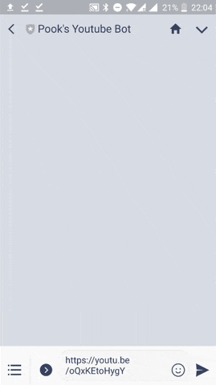
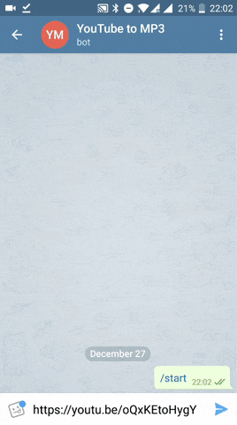

YouTube to MP3 Chat Bot
========================

This LINE and Telegram Chat bot accepts a YouTube link, converts the video to to MP3, upload the converted MP3 to Amazon S3 and sends back the download link.

The project is developed using Java and Spring Boot. [youtube-dl](https://github.com/rg3/youtube-dl) is used for video download and conversion.

Currently support these platforms:

- LINE
- Telegram

Screenshot
-----------

|                LINE               |                  Telegram                 |
|:---------------------------------:|:-----------------------------------------:|
|  |  |


Try It Out IRL
--------------

### Telegram

[https://t.me/YouTube_MP3_Converter_Bot](https://t.me/YouTube_MP3_Converter_Bot)

### LINE

Add by QR code


Getting started
----------------

### One-off Setup

1. Sign up for LINE bot account
1. Create Telegram Bot using BotFather
1. Create S3 bucket to be used to MP3 file upload

### Running Locally

1. Complete steps in One-off Setup
1. Install [youtube-dl](https://github.com/rg3/youtube-dl) and [ffmpeg](https://www.ffmpeg.org/download.html) binary on your machine.
1. Clone or fork this repo
1. Import as Maven project
1. Edit S3, LINE and Telegram config in ```application.yaml```

### Running on Heroku

1. Complete steps in One-off Setup

1. Clone or fork this repo

1. Deploy on Heroku with this [buildpack](https://github.com/veeraya/heroku-buildpack-ffmpeg-latest.git) containing ffmpeg and youtube-dl binaries.

    ```
    heroku create
    heroku buildpacks:add https://github.com/veeraya/heroku-buildpack-ffmpeg-latest.git
    git push heroku master
    ```

1. Set up the following config variables on Heroku.
    - AWS_ACCESS_KEY_ID
    - AWS_SECRET_ACCESS_KEY
    - LINE_BOT_CHANNEL_SECRET
    - LINE_BOT_CHANNEL_TOKEN
    - TELEGRAM_BOTTOKEN
    - TELEGRAM_BOTUSERNAME